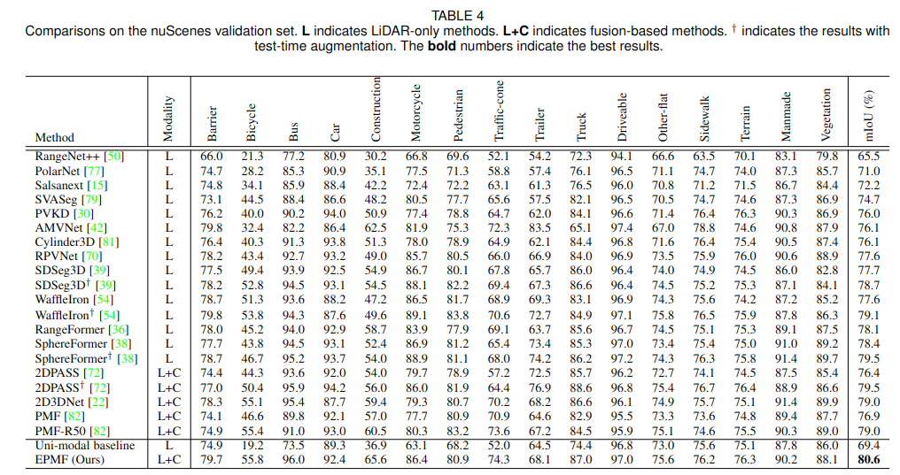
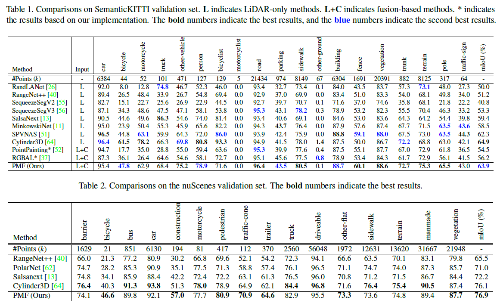
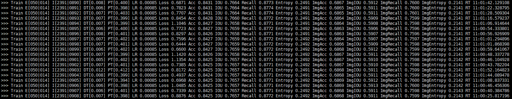

# Perception-Aware Multi-Sensor Fusion for 3D LiDAR Semantic Segmentation (ICCV 2021)

[中文|[EN](./README_en.md)]

## 概述

本工作主要探索一种高效的多传感器（激光雷达和摄像头）融合点云语义分割方法。现有的多传感器融合方法主要将点云投影到图像上，获取对应的像素位置之后，将对应位置的图像信息投影回点云空间进行特征融合。但是，这种方式下并不能很好的利用图像丰富的视觉感知特征（例如形状、纹理等）。因此，我们尝试探索一种在RGB图像空间进行特征融合的方式，提出了一个基于视觉感知的多传感器融合方法（PMF)。详细内容可以查看我们的公开论文。


## 更新

我们对PMF进行了拓展，进一步提升该方法的效率和精度，同时提供了更多的分析结果。未来我们将公开相关的预训练模型以及代码。(如图为EPMF-ResNet34结果)




## 主要实验结果

[](https://paperswithcode.com/sota/lidar-semantic-segmentation-on-nuscenes?p=perception-aware-multi-sensor-fusion-for-3d)

[Leader board of SensatUrban@ICCV2021](https://competitions.codalab.org/competitions/31519#results)



## 更多实验结果

我们在持续探索PMF框架的潜力，包括探索更大的模型、更好的ImageNet预训练模型、其他的数据集等。我们的实验结果证明了，PMF框架是易于拓展的，并且其性能可以通过使用更好的主干网络而实现提升。详细的说明可以查看[文件](./more_experiment_config.md)。

| 方法            | 数据集                                                       | mIoU (%)      |
| --------------- | ------------------------------------------------------------ | ------------- |
| PMF-ResNet34    | SemanticKITTI Validation Set                                 | 63.9          |
| PMF-ResNet34    | nuScenes Validation Set                                      | 76.9          |
| PMF-ResNet50    | nuScenes Validation Set                                      | 79.4          |
| PMF48-ResNet101 | SensatUrban Test Set ([ICCV2021 Competition](https://competitions.codalab.org/competitions/31519#results)) | 66.2 (排名 5) |


## 使用说明

注：代码中涉及到包括数据集在内的各种**路径配置**，请根据自己的**实际路径**进行修改

### 代码结构

```
|--- pc_processor/ 点云处理的Python包
	|--- checkpoint/ 生成实验结果目录
	|--- dataset/ 数据集处理
	|--- layers/ 常用网络层
	|--- loss/ 损失函数
	|--- metrices/ 模型性能指标函数
	|--- models/ 网络模型
	|--- postproc/ 后处理，主要是KNN
	|--- utils/ 其他函数
|--- tasks/ 实验任务
	|--- pmf/ PMF 训练源代码
	|--- pmf_eval_nuscenes/ PMF 模型在nuScenes评估代码
		|--- testset_eval/ 合并PMF以及salsanext结果并在nuScenes测试集上评估
		|--- xxx.py PMF 模型在nuScenes评估代码
	|--- pmf_eval_semantickitti/ PMF 在SemanticKITTI valset上评估代码
	|--- salsanext/ SalsaNext 训练代码，基于官方公开代码进行修改
	|--- salsanext_eval_nuscenes/ SalsaNext 在nuScenes 数据集上评估代码
```


### 模型训练

#### 训练任务代码目录结构

```
|--- pmf/
	|--- config_server_kitti.yaml SemanticKITTI数据集训练的配置脚本
	|--- config_server_nus.yaml nuScenes数据集训练的配置脚本
	|--- main.py 主函数
	|--- trainer.py 训练代码
	|--- option.py 配置解析代码
	|--- run.sh 执行脚本，需要 chmod+x 赋予可执行权限
```

#### 步骤

1. 进入 `tasks/pmf`目录，修改配置文件 `config_server_kitti.yaml`中数据集路径 `data_root` 为实际数据集路径。如果有需要可以修改`gpu`，`batch_size`等参数
2. 修改 `run.sh` 确保 `nproc_per_node` 的数值与yaml文件中配置的`gpu`数量一致
3. 运行如下指令执行训练脚本

```bash
./run.sh
# 或者 bash run.sh
```

4. 执行成功之后会在 `PMF/experiments/PMF-SemanticKitti`路径下自动生成实验日志文件，目录结构如下：

```
|--- log_dataset_network_xxxx/
	|--- checkpoint/ 训练断点文件以及最佳模型参数
	|--- code/ 代码备份
	|--- log/ 控制台输出日志以及配置文件副本
	|--- events.out.tfevents.xxx tensorboard文件
```

控制台输出内容如下，其中最后的输出时间为实验预估时间



### 模型推理

#### 模型推理代码目录结构

```
|--- pmf_eval_semantickitti/ SemanticKITTI评估代码
	|--- config_server_kitti.yaml 配置脚本
	|--- infer.py 推理脚本
	|--- option.py 配置解析脚本
```

#### 步骤

1. 进入 `tasks/pmf_eval_semantickitti`目录，修改配置文件 `config_server_kitti.yaml`中数据集路径 `data_root` 为实际数据集路径。修改`pretrained_path`指向训练生成的日志文件夹目录。
2. 运行如下命令执行脚本

```bash
python infer.py config_server_kitti.yaml
```

3. 运行成功之后，会在训练模型所在目录下生成评估结果日志文件，文件夹目录结构如下：

```
|--- PMF/experiments/PMF-SemanticKitti/log_xxxx/ 训练结果路径
	|--- Eval_xxxxx/ 评估结果路径
		|--- code/ 代码备份
		|--- log/ 控制台日志文件
		|--- pred/ 用于提交评估的文件
```

### 预训练模型

- [SemanticKITTI-PMF-ResNet34](https://drive.google.com/drive/folders/122Wu2QTvYfPng96BYTkIEGX64Uck5sfK?usp=drive_link)
- 未完待续


## 引用

```
@InProceedings{Zhuang_2021_ICCV,
    author    = {Zhuang, Zhuangwei and Li, Rong and Jia, Kui and Wang, Qicheng and Li, Yuanqing and Tan, Mingkui},
    title     = {Perception-Aware Multi-Sensor Fusion for 3D LiDAR Semantic Segmentation},
    booktitle = {Proceedings of the IEEE/CVF International Conference on Computer Vision (ICCV)},
    month     = {October},
    year      = {2021},
    pages     = {16280-16290}
}
```


