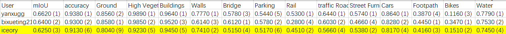

# Perception-aware Multi-sensor Fusion for 3D LiDAR Semantic Segmentation (ICCV 2021)

We will release our code soon ... 


## More Results

### nuScenes Test-split

#### Settings

- Please refer to our paper
- No finetuning on val-split
- No extra post-processing (e.g., KNN or test time augmentation techniques)
- For LiDAR points that are outside the camera view, we use predictions of SalsaNext instead (mIoU 71.1%).

#### PMF with ResNet-50 (val 79.4, test 77.0)

```json
{
    "iou_per_class": {
        "ignore": NaN,
        "barrier": 0.8211105017000947,
        "bicycle": 0.40331001357418816,
        "bus": 0.8094285738418642,
        "car": 0.8642617074093626,
        "construction_vehicle": 0.6372293564531284,
        "motorcycle": 0.7922127573147274,
        "pedestrian": 0.7975465273184825,
        "traffic_cone": 0.7586693667592976,
        "trailer": 0.8117486721972303,
        "truck": 0.6705541303436428,
        "driveable_surface": 0.9728147267514662,
        "other_flat": 0.6769763882499247,
        "sidewalk": 0.7805199833640492,
        "terrain": 0.7448217093570576,
        "manmade": 0.8994327878399728,
        "vegetation": 0.8846873564010126
    },
    "miou": 0.770332784929719,
    "freq_weighted_iou": 0.8934698554118091
}
```

#### PMF with ResNet-34 (val 76.9, test 75.5)

```json
nuScenes-lidarseg evaluation for test
{
    "iou_per_class": {
        "ignore": NaN,
        "barrier": 0.8020705030641955,
        "bicycle": 0.3566210931187175,
        "bus": 0.7969964698841939,
        "car": 0.8601428244796276,
        "construction_vehicle": 0.6244473195702313,
        "motorcycle": 0.7633778382116776,
        "pedestrian": 0.769487379072612,
        "traffic_cone": 0.73647345145876,
        "trailer": 0.7846033037308205,
        "truck": 0.6690532353903471,
        "driveable_surface": 0.9708182972435588,
        "other_flat": 0.6525864086450294,
        "sidewalk": 0.7763474699301498,
        "terrain": 0.7437597404653619,
        "manmade": 0.894987783349729,
        "vegetation": 0.8768202551077896
    },
    "miou": 0.7549120857951751,
    "freq_weighted_iou": 0.8892288961616917
}
```


### SensatUrban (ICCV2021)

#### Settings

- Based on our settings on nuScenes
- Use bird-view projection to generate point cloud feature maps
- No ImageNet pretrained (Required by the competition)
- No finetuning on val-split
- No extra post-processing (e.g., KNN or test time augmentation techniques)

#### PMF with ResNet-50



## Citation
```
@article{zhuang2021perception,
  title={Perception-aware Multi-sensor Fusion for 3D LiDAR Semantic Segmentation},
  author={Zhuang, Zhuangwei and Li, Rong and Li, Yuanqing and Jia, Kui and Wang, Qicheng and Tan, Mingkui},
  journal={arXiv preprint arXiv:2106.15277},
  year={2021}
}
```

